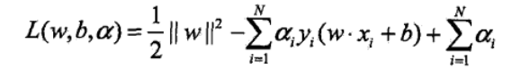

========================
SVM
========================

定义在特征空间上的间隔最大的线性分类器

求解一个凸二次规划(convex quadratic programming)的问题

超平面方程 :math:`w^{T}\cdot x + b = 0` 相应的分类决策函数 :math:`f(x)=sign(w^{T}\cdot x + b)` , 用 :math:`y(w\cdot x + b)` 来表示分类的正确性及确信度，这就是函数间隔(functional margin)的概念

定义超平面(w,b)关于训练数据集T的函数间隔为超平面(w,b)关于T中所有样本点(xi,yi)的函数间隔之最小值，SVM是找到这个最小值的最大值

对分离超平面的法向量w加某些约束，如规范化, ||w|| = 1, 使间隔是确定的. 定义超平面(w,b)关于样本点(xi,yi)的几何间隔为 :math:`r_{i} = y_{i}(\frac{w\dot x_{i} + b}{||w||})`

.. math::
  max r
  s.t. y_{i}(\frac{w\dot x_{i} + b}{||w||}) >= r, i=1,2,...,N

等价于

.. math::
  min \frac{1}{2}||w||^{2}
  s.t. y_{i}(w\dot x_{i} + b) >= 0, i=1,2,...,N

对偶问题：

